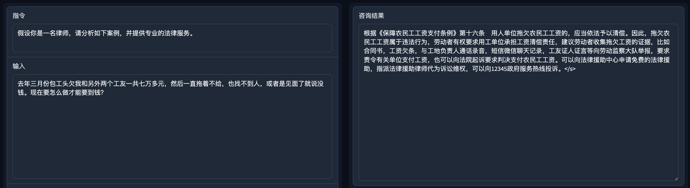
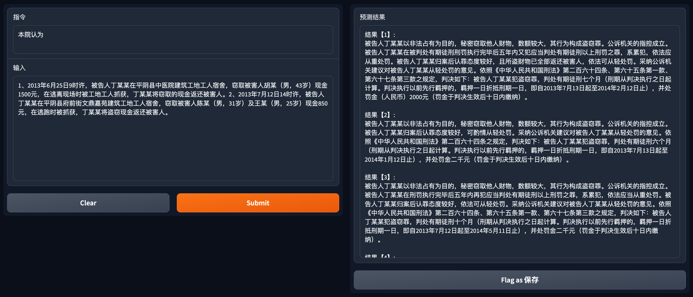

[**中文**](./README.md) | [**English**](./README_en.md)

# JurisLMs: Jurisprudential Language Models

## 项目背景
<p align = "justify"> ChatGPT, GPT4在自然语言处理领域带来了突破性的进展，其涌现能力令人印象深刻。然而，经验表明，这些模型在特定领域的表现难以令人满意，特别是在法律等专业知识密集型的场景，常见的局限表现为知识幻觉，无法进行准确的法条适用，生成内容过于空泛等。</p>

<p align = "justify">为了缓解上述挑战，我们基于中文法学语料训练了一系列语言模型，JurisLMs。根据不同的场景在法律法规、法律咨询、裁判文书等多种不同的语料上进一步预训练了多个模型。其中，AI Judge是由GPT2在法学语料上进一步预训练之后，结合一个<u>法条适用模型</u>（一个基于BERT的分类器）微调得到的一个<font color=#FF000>可解释法律判决预测模型</font>。现有判决预测模型往往只能给出预测结果，无法对结果进行说理。基于此，本项目提出了AI Judge，不仅能够给出判决结果，还能给出相应的法院观点。基于类似的框架，我们训练了一个基于中文LLaMA的<font color=#FF000>智能法律咨询模型</font>，AI Lawyer。由于缺乏标注法条的咨询语料，我们采用<u>主动学习（Active Learning）</u>在少量数据上进行微调获得一个<u>法律适用模型</u>，使得AI Lawyer可以根据用户咨询适用正确的法律法规回答问题。</p>


## AI Lawyer 示例及使用
<!---<div align=center></div>
<center style="font-size:14px;color:#C0C0C0;text-decoration:underline">AI Lawyer 框架</center>
<br>--->

<div align=center></div>
<center style="font-size:14px;color:#C0C0C0;text-decoration:underline">法律咨询</center>
<br>

```python
#!/usr/bin/env python3
# -*- coding: utf-8 -*-
import torch
from peft import PeftModel
from transformers import LlamaTokenizer, LlamaForCausalLM, GenerationConfig

def generate_prompt(instruction, input=None):
    if input:
        return f"""Below is an instruction that describes a task, paired with an input that provides further context. Write a response that appropriately completes the request.

### Instruction:
{instruction}

### Input:
{input}

### Response:
"""
    else:
        return f"""Below is an instruction that describes a task. Write a response that appropriately completes the request.

### Instruction:
{instruction}

### Response:
"""

base_model = "your_llama_dir" # download from https://github.com/ymcui/Chinese-LLaMA-Alpaca (13B)
lora_weights = "your_lora_dir" # download from https://huggingface.co/seussg/ailawyer

instruction = "假设你是一名律师，请分析如下案例，并提供专业的法律服务。"
_input = "去年三月份包工头欠我和另外两个工友一共七万多元，然后一直拖着不给，也找不到人，或者是见面了就说没钱。现在要怎么做才能要到钱？"  

tokenizer = LlamaTokenizer.from_pretrained(base_model)
model = LlamaForCausalLM.from_pretrained(base_model,
            load_in_8bit=False,
            torch_dtype=torch.float16,
            device_map="auto")
model = PeftModel.from_pretrained(model, lora_weights, torch_dtype=torch.float16).half()

model.config.pad_token_id = tokenizer.pad_token_id = 0
model.config.bos_token_id = 1
model.config.eos_token_id = 2
model.eval()

prompt = generate_prompt(instruction, _input)
inputs = tokenizer(prompt, return_tensors="pt")

input_ids = inputs["input_ids"].to("cuda")
generation_config = GenerationConfig(temperature=0.1, top_p=0.75, top_k=1, num_beams=1)
with torch.no_grad():
    generation_output = model.generate(
        input_ids=input_ids,
        generation_config=generation_config,
        return_dict_in_generate=True,
        output_scores=True,
        max_new_tokens=500,
    )
output_ids = generation_output.sequences[0]
output = tokenizer.decode(output_ids)
print(output.split("### Response:")[1].strip())

# Response: 根据《保障农民工工资支付条例》第十六条　用人单位拖欠农民工工资的，应当依法予以清偿。因此，拖欠农民工工资属于违法行为，劳动者有权要求用工单位承担工资清偿责任，建议劳动者收集拖欠工资的证据，比如合同书，工资欠条，与工地负责人通话录音，短信微信聊天记录，工友证人证言等向劳动监察大队举报，要求责令有关单位支付工资，也可以向法院起诉要求判决支付农民工工资。可以向法律援助中心申请免费的法律援助，指派法律援助律师代为诉讼维权，可以向12345政府服务热线投诉。</s>
```


## AI Judge 示例及使用
<!---<div align=center></div>
<center style="font-size:14px;color:#C0C0C0;text-decoration:underline">AI Judge 框架</center>
<br>--->

<div align=center></div>
<center style="font-size:14px;color:#C0C0C0;text-decoration:underline">辅助量刑（输出top5生成结果）</center>
<br>

```python
import torch
from transformers import BertTokenizer, GPT2LMHeadModel, TextGenerationPipeline

fact_description = "1、2013年6月25日9时许，被告人丁某某在平阴县中医院建筑工地工人宿舍，窃取被害人胡某（男，43岁）现金1500元，在逃离现场时被工地工人抓获，丁某某将窃取的现金返还被害人。2、2013年7月12日14时许，被告人丁某某在平阴县府前街文鼎嘉苑建筑工地工人宿舍，窃取被害人陈某（男，31岁）及王某（男，25岁）现金850元，在逃跑时被抓获，丁某某将盗窃现金返还被害人。"
model_name = "seussg/aijudge"
device = torch.device("cuda:0" if torch.cuda.is_available() else "cpu")
tokenizer = BertTokenizer.from_pretrained(model_name)
model = GPT2LMHeadModel.from_pretrained(model_name).to(device)
generator = TextGenerationPipeline(model, tokenizer, device=0)
generator.tokenizer.pad_token_id = generator.model.config.eos_token_id
prediction = generator(fact_description,
                                max_length=1024,
                                num_beams=1,
                                top_p=0.7,
                                num_return_sequences=1,
                                eos_token_id=50256,
                                pad_token_id=generator.model.config.eos_token_id)

court_view = prediction[0]["generated_text"].replace(" ", "").split("。本院认为，")[1].split("<生成结束>")[0]
```

## 评测结果
本项目采用自动和人工结合的方式评估模型的性能。
自动评估方面，对于辅助判决，主要评估法条、罪名、刑期和罚金的F1作为自动评估。

人工评估方面，对于辅助判决，评估以下三个指标：
- Correctness，用于评估生成的法院观点中情节概括是否正确合理；
- is_Human：法院观点是否由人工撰写；
- Availability：评估生成结果的是否可用。

类似的，对于法律咨询，评估Correctness（对咨询中提及的事实是否理解准确），is_Human（法律咨询是否由人工撰写）和Availability（同上）。

对于每个评测任务，从测试集中随机选择200个样本，并随机分为两组。其中一组全部由模型生成，标记为LJP_Model和QA_Model；另一组为真实样本，标记为LJP_Human和QA_Human。打乱后随机分发至10名法学本科生、研究生（标注人员无法查看样本是否由机器生成的标记）。每个样本至少有3名学生进行标注，取多数为标注结果。最终评测结果如下：

### AI Judge
- 自动评测（LJP_Model）

| F1 (topk) | 法条   | 罪名   | 刑期   | 罚金   |
| --------- | ------ | ------ | ------ | ------ |
| F1 (top1) | 86.66  | 89.85  | 73.53  | 63.87  |
| F1 (top3) | 89.23  | 91.57  | 76.18  | 65.32  |
| F1 (top5) | 90.85  | 92.66  | 78.23  | 66.19  |

法条预测性能随k的变化大于罪名，主要的误差出现在一些附加刑（如刑法第34条）的预测上。相比传统以分类为主的量刑预测方法，生成式语言模型获得了更高的F1。遵循现有研究，对于刑期，按照月份计算，±20%认为正确；对于罚金，按照以下区间进行划分：[0, 1,000), [1,000, 2000), [2000, 3000), [3,000, 4,000), [4,000, 5,000), [5,000, 10,000), [10,000, 50,000), [50,000, 200,000), [200,000, 500,000), [500,000, 1,000,000), [1,000,000, +∞). 

- 人工评测

|              | LJP_Model | LJP_Model | LJP_Model | LJP_Human | LJP_Human | LJP_Human |
| -----------  | --------- | --------- | --------- | --------- | --------- | --------- |
|              | Correctness | is_Human | Availability | Correctness | is_Human | Availability |
| **说理**        |    78       |    71    |    73       |     97      |    91    |    95    |

仔细观察数据可发现，情节概括中容易出现诸如“坦白”、“态度较好”等，往往在给定事实中没有提及。当案件情节概括出现错误，结果倾向于被标注为非人类撰写。当标注人员认为一个结果是由人类撰写时，偏向于认为该结果可接受。

### AI Lawyer

|              | QA_Model | QA_Model | QA_Model | QA_Human | QA_Human | QA_Human |
| -----------  | --------- | --------- | --------- | --------- | --------- | --------- |
|              | Correctness | is_Human | Availability | Correctness | is_Human | Availability |
| **咨询**        |    90       |    81    |    82       |     95      |    89    |    91    |

模型对咨询中的情节认定通常比较简单，比如借贷、欠薪等，准确度较高。只有少数设计复杂情节，如涉及多个对象，模型可能难以厘清多对象之间的关系。从整理来看，AI Lawyer已经可以在大部分法律咨询中相对准确地认定事实，并给出接近人的回复。


## 已知局限性
尽管通过专业人员标注和评估，JurisLMs很大程度缓解了现有方法的局限性，但仍不可避免。包括但不限于以下问题：
- 可能存在忽略关键事实或增加不存在的内容
- 可能出现角色逻辑错误
- 可能出现结论错误
- 可能出现适用过时法条
- 可能难以发现数字中隐含的信息

## 未来研究
- 面向法律咨询的多轮问答（ing）
- 在10G法学语料上全量微调ChatGLM-6B（ing）
- 大语言模型在法律应用上的性能评测
- 基于对话生成模型在法律领域的应用

## 致谢
JurisLMs借鉴如下优秀的开源项目：
- [LLaMA](https://github.com/facebookresearch/llama)
- [中文LLaMA](https://github.com/ymcui/Chinese-LLaMA-Alpaca)
- [LLaMA-Alpaca](https://github.com/tloen/alpaca-lora)
- [高效微调PEFT](https://github.com/huggingface/peft)
- [gradio](https://github.com/gradio-app/gradio)


## 免责声明
<p align = "justify">本项目仅供学术研究之用，严禁用于商业用途。本项目生成的内容受算法、随机性和量化精度等因素影响，其准确性难以保证。尽管本项目已经努力确保所使用数据的准确性和及时性，但由于语言模型的特性，仍可能受到信息和法律发展的滞后影响。因此，对于模型输出的任何内容，本项目不承担任何法律责任，亦不对因使用相关资源和输出结果而可能产生的任何损失承担责任。机器不应也无法替代寻求专业法律咨询的过程，在涉及具体法律问题或案件时，请咨询合格的律师或法律专业人士以获取个性化的建议。</p>

