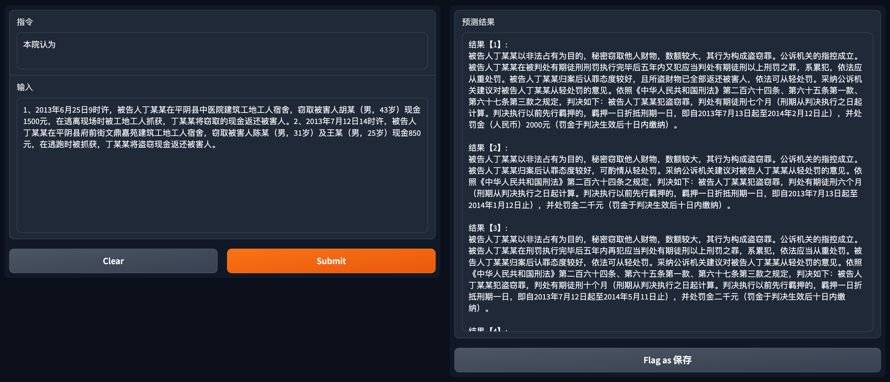

[**中文**](./README.md) | [**English**](./README_en.md)

# JurisLMs: Jurisprudential Language Models
----
## Project Description
<p align = "justify"> The advent of ChatGPT, specifically GPT-4, has engendered groundbreaking strides in the realm of natural language processing, with its generative capabilities inducing profound impressions. However, empirical observations suggest that these models often falter in specific domains, notably in knowledge-intensive areas such as law, where common limitations manifest as knowledge hallucinations, inability to accurately apply legal provisions, and the generation of excessively abstract content. </p>

<p align = "justify"> To mitigate the aforementioned challenges, we have trained a series of language models, namely JurisLMs, on Chinese legal corpora. These models have been further pretrained on diverse datasets including legislations, legal consultations, and judicial documents, tailored to distinct scenarios. Among these, AI Judge, a model fine-tuned after further pretraining of GPT-2 on legal corpora and combined with a <u>legal provision application model</u> (a classifier based on BERT), is an <font color=#FF000>explainable legal decision prediction model</font>. Existing decision making models typically yield predictions but fail to rationalize them. To address this, AI Judge not only provides verdict predictions but also corresponding court views. Leveraging a similar framework, we have trained an <font color=#FF000>intelligent legal consultation model</font>, AI Lawyer, based on Chinese LLaMA. Owing to the scarcity of consultation corpora annotated with legal provisions, we have employed <u>Active Learning</u> to fine-tune a <u>legal provision application model</u> on a limited dataset, enabling AI Lawyer to answer queries by correctly applying corresponding judicial perspectives.</p>


## AI Lawyer Demo and Usage
<!---<div align=center></div>
<center style="font-size:14px;color:#C0C0C0;text-decoration:underline">AI Lawyer 框架</center>
<br>--->

<div align=center></div>
<center style="font-size:14px;color:#C0C0C0;text-decoration:underline">Legal consultation</center>
<br>

```python
#!/usr/bin/env python3
# -*- coding: utf-8 -*-
import torch
from peft import PeftModel
from transformers import LlamaTokenizer, LlamaForCausalLM, GenerationConfig

def generate_prompt(instruction, input=None):
    if input:
        return f"""Below is an instruction that describes a task, paired with an input that provides further context. Write a response that appropriately completes the request.

### Instruction:
{instruction}

### Input:
{input}

### Response:
"""
    else:
        return f"""Below is an instruction that describes a task. Write a response that appropriately completes the request.

### Instruction:
{instruction}

### Response:
"""

base_model = "your_llama_dir" # download from https://github.com/ymcui/Chinese-LLaMA-Alpaca (13B)
lora_weights = "your_lora_dir" # download from https://huggingface.co/seussg/ailawyer

instruction = "假设你是一名律师，请分析如下案例，并提供专业的法律服务。"
_input = "去年三月份包工头欠我和另外两个工友一共七万多元，然后一直拖着不给，也找不到人，或者是见面了就说没钱。现在要怎么做才能要到钱？"  

tokenizer = LlamaTokenizer.from_pretrained(base_model)
model = LlamaForCausalLM.from_pretrained(base_model,
            load_in_8bit=False,
            torch_dtype=torch.float16,
            device_map="auto")
model = PeftModel.from_pretrained(model, lora_weights, torch_dtype=torch.float16).half()

model.config.pad_token_id = tokenizer.pad_token_id = 0
model.config.bos_token_id = 1
model.config.eos_token_id = 2
model.eval()

prompt = generate_prompt(instruction, _input)
inputs = tokenizer(prompt, return_tensors="pt")

input_ids = inputs["input_ids"].to("cuda")
generation_config = GenerationConfig(temperature=0.1, top_p=0.75, top_k=1, num_beams=1)
with torch.no_grad():
    generation_output = model.generate(
        input_ids=input_ids,
        generation_config=generation_config,
        return_dict_in_generate=True,
        output_scores=True,
        max_new_tokens=500,
    )
output_ids = generation_output.sequences[0]
output = tokenizer.decode(output_ids)
print(output.split("### Response:")[1].strip())

# Response: 根据《保障农民工工资支付条例》第十六条　用人单位拖欠农民工工资的，应当依法予以清偿。因此，拖欠农民工工资属于违法行为，劳动者有权要求用工单位承担工资清偿责任，建议劳动者收集拖欠工资的证据，比如合同书，工资欠条，与工地负责人通话录音，短信微信聊天记录，工友证人证言等向劳动监察大队举报，要求责令有关单位支付工资，也可以向法院起诉要求判决支付农民工工资。可以向法律援助中心申请免费的法律援助，指派法律援助律师代为诉讼维权，可以向12345政府服务热线投诉。</s>
```


## AI Judge Demo and Usage
<!---<div align=center></div>
<center style="font-size:14px;color:#C0C0C0;text-decoration:underline">AI Judge 框架</center>
<br>--->

<div align=center></div>
<center style="font-size:14px;color:#C0C0C0;text-decoration:underline">Legal Judgment Prediction (top 5)</center>
<br>

```python
import torch
from transformers import BertTokenizer, GPT2LMHeadModel, TextGenerationPipeline

fact_description = "1、2013年6月25日9时许，被告人丁某某在平阴县中医院建筑工地工人宿舍，窃取被害人胡某（男，43岁）现金1500元，在逃离现场时被工地工人抓获，丁某某将窃取的现金返还被害人。2、2013年7月12日14时许，被告人丁某某在平阴县府前街文鼎嘉苑建筑工地工人宿舍，窃取被害人陈某（男，31岁）及王某（男，25岁）现金850元，在逃跑时被抓获，丁某某将盗窃现金返还被害人。"
model_name = "seussg/aijudge"
device = torch.device("cuda:0" if torch.cuda.is_available() else "cpu")
tokenizer = BertTokenizer.from_pretrained(model_name)
model = GPT2LMHeadModel.from_pretrained(model_name).to(device)
generator = TextGenerationPipeline(model, tokenizer, device=0)
generator.tokenizer.pad_token_id = generator.model.config.eos_token_id
prediction = generator(fact_description,
                                max_length=1024,
                                num_beams=1,
                                top_p=0.7,
                                num_return_sequences=1,
                                eos_token_id=50256,
                                pad_token_id=generator.model.config.eos_token_id)

court_view = prediction[0]["generated_text"].replace(" ", "").split("。本院认为，")[1].split("<生成结束>")[0]
```

## Results
<p align = "justify">This project evaluates the performance of models using a hybrid of automatic and manual methods.
Automatic evaluations focus on auxiliary judgments, assessing legal articles, charges, imprisonment, and fines with the <b>F1</b> score.</p>

Manual evaluations for legal judgment prediction (LJP) the following three criteria:

- **Correctness**, evaluating whether the generated court opinions accurately summarize the circumstances;
- **is_Human**, determining if the court opinions are written by humans;
- **Availability**, evaluating the usability of the generated results.

<p align = "justify">Similarly, for legal consultations, evaluations are based on Correctness (understanding the facts mentioned in the consultation accurately), is_Human (whether the legal consultation is written by humans), and Availability (as above).</p>

<p align = "justify">For each evaluation task, 200 samples are randomly selected from the test set and divided into two groups. One group is entirely generated by the model, labeled as LJP_Model and QA_Model; the other group comprises real samples, labeled as LJP_Human and QA_Human. After shuffling, these are randomly distributed among ten law undergraduates and postgraduates (the annotators are unable to see whether the samples were generated by a machine). Each sample is annotated by at least three students, with the majority ruling as the annotation result. The final evaluation results are as follows:</p>

### AI Judge
- Automatic Evaluation（LJP_Model）

| F1 (topk) | Legal Article   | Legal Charge   | Imprisonment   | Fine   |
| --------- | ------ | ------ | ------ | ------ |
| F1 (top1) | 86.66  | 89.85  | 73.53  | 63.87  |
| F1 (top3) | 89.23  | 91.57  | 76.18  | 65.32  |
| F1 (top5) | 90.85  | 92.66  | 78.23  | 66.19  |

<p align = "justify">The performance of predicting legal provisions varies more with k than that of charges, and the major errors occur in predictions of supplementary punishments (附加刑), such as <u>Article 34</u>. Compared with traditional judgment prediction methods, which mainly focus on classification, generative language models achieve higher F1 scores. Following existing research, for imprisonment prediction, those calculated by months are considered correct within a ±20% range; for fines, they are divided into the following intervals: [0, 1,000), [1,000, 2000), [2000, 3000), [3,000, 4,000), [4,000, 5,000), [5,000, 10,000), [10,000, 50,000), [50,000, 200,000), [200,000, 500,000), [500,000, 1,000,000), [1,000,000, +∞). </p>

- Manual Evaluation

|              | LJP_Model | LJP_Model | LJP_Model | LJP_Human | LJP_Human | LJP_Human |
| -----------  | --------- | --------- | --------- | --------- | --------- | --------- |
|              | Correctness | is_Human | Availability | Correctness | is_Human | Availability |
| **Court View**        |    78       |    71    |    73       |     97      |    91    |    95    |

<p align = "justify">Upon careful examination of the data, it is noticeable that terms such as "confessing" and "good attitude" often appear in the summary of circumstances, which are typically not mentioned in the given facts. When errors occur in the summary of a case's circumstances, the result tends to be annotated as non-human. When annotators believe that a result is written by a human, they tend to deem the result acceptable. </p>

### AI Lawyer

|              | QA_Model | QA_Model | QA_Model | QA_Human | QA_Human | QA_Human |
| -----------  | --------- | --------- | --------- | --------- | --------- | --------- |
|              | Correctness | is_Human | Availability | Correctness | is_Human | Availability |
| **咨询**        |    90       |    81    |    82       |     95      |    89    |    91    |


<p align = "justify">The model's recognition of incidents in consultations is typically straightforward, such as loans and wage arrears, with a relatively high accuracy. Only a minority of complex situations involving multiple parties pose a challenge to the model in clarifying the relationships among them. Overall, AI Lawyer can accurately recognize facts in most legal consultations and provide responses akin to those of a human.</p>


## Acknowledged Limitations

Despite the alleviation of many limitations of existing methods through professional annotation and evaluation, JurisLMs inevitably face certain challenges, including but not limited to the following issues:

- Possible omission of critical facts or addition of non-existent content
- Potential logical errors in roles
- Possibility of incorrect conclusions
- Application of outdated legal provisions
- Difficulty in discovering information hidden in numerals

## Future Endeavors
- Multi-round question and answer sessions for legal consultations (ing)
- Full fine-tuning of ChatGLM-6B on 10G of legal corpora (ing)
- Performance evaluation of large language models in legal applications
- Application of JurisLMs in the legal domain

## Acknowledgements
JurisLMs is indebted to the following outstanding open-source projects:
- [LLaMA](https://github.com/facebookresearch/llama)
- [Chinese LLaMA](https://github.com/ymcui/Chinese-LLaMA-Alpaca)
- [LLaMA-Alpaca](https://github.com/tloen/alpaca-lora)
- [PEFT](https://github.com/huggingface/peft)
- [gradio](https://github.com/gradio-app/gradio)


## Disclaimer
<p align = "justify"> This project is exclusively for academic research purposes and strictly prohibited for commercial use. The accuracy of the content generated by this project is subject to factors such as algorithms, randomness, and quantitative precision, hence difficult to guarantee. Although utmost efforts have been made to ensure the accuracy and timeliness of the data used, the characteristics of language models may still cause a lag in information and legal developments. Therefore, this project assumes no legal liability for any content output by the model, nor does it assume responsibility for any losses that may arise from the use of related resources and output results. Machines should not and cannot replace the process of seeking professional legal advice. In the event of specific legal issues or cases, it is recommended to consult a qualified lawyer or legal professional to obtain personalized advice. </p>


